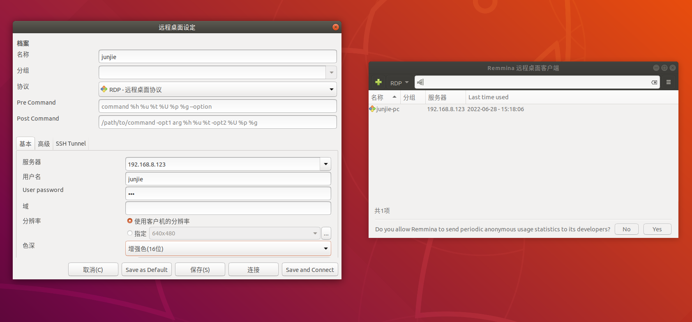
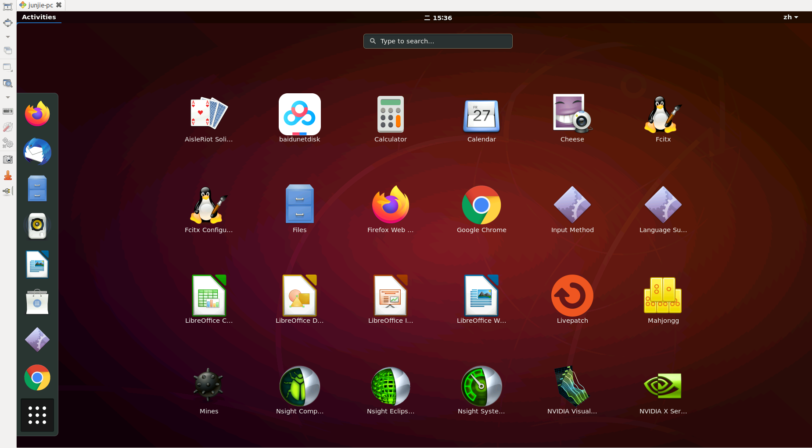

# 在junjie-pc上使用远程桌面

* 在你自己的电脑上下载remmina客户端

  ```
  sudo apt install remmina
  ```
* 将你的电脑和远程电脑（junjie-pc）连在同一个局域网内
* 打开remmina软件，输入用户名密码等

  
* 色深使用增强色16位，如上图
* 就成功啦！

  

# 附录：如何安装远程桌面？

参考：[在Ubuntu18.04上安装远程桌面](https://github.com/daxiongpro/Qdotfiles/blob/master/docs/desktop.md)
